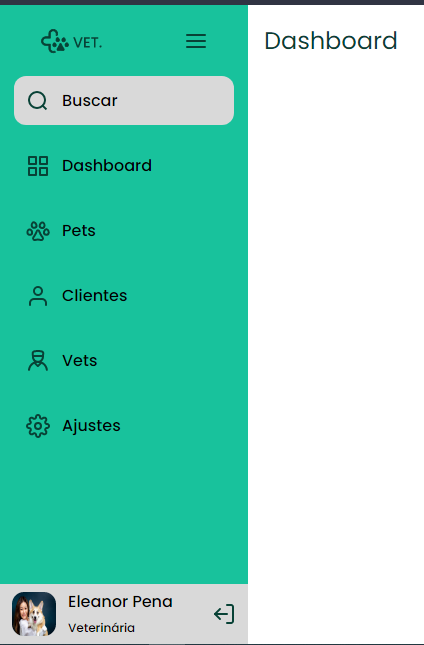

<h1 align="center">
  
</h1>

<p align="center">
  
</p>


## 💻 Projeto
Projeto que imita a interface do Figma Jam, sendo assim um whiteboard.

## 🔃 Requisitos para utilizar

É necessário ter um navegador e internet acessar a aplicação.

## ✨ Tecnologias

-   [ x ] Typescript
-   [ x ] React
-   [ x ] Tailwind CSS
-   [ x ] Vite


## :hammer_and_wrench: Features 

-   [ ] Blocos podem ser movidos.
-   [ ] Blocos podem ser redimensionados.
-   [ ] É possível criar novos blocos.
-   [ ] Os blocos podem se conectar.


## 📲 Executando o projeto

Utilize o **yarn** ou o **npm install** para instalar as dependências do projeto.
Em seguida, inicie o projeto.

```cl
npm run dev
```

## 🆚 Versionamento / Versioning

Esse projeto não possui um sistema de versionamento.

## 🆙 Projeto no ar

É possível acessar a aplicação através da URL: https://whiteboard-ten.vercel.app/ .

## 👨‍💻 Contribuir / Contributing

Deseja contribuir com o projeto? [Passo a passo para contribuir](https://github.com/silasfmartins/whiteboard/blob/master/Contributing.md)

## 💿 Histórico / History

Consulte [Releases](https://github.com/silasfmartins/whiteboard/releases) para ter um changelog completo.

## 📄 Licença do Projeto/License

Esse projeto está sob a licença MIT. Veja o arquivo [LICENSE](https://github.com/silasfmartins/whiteboard/blob/main/LICENSE) © Silas Martins para mais detalhes.